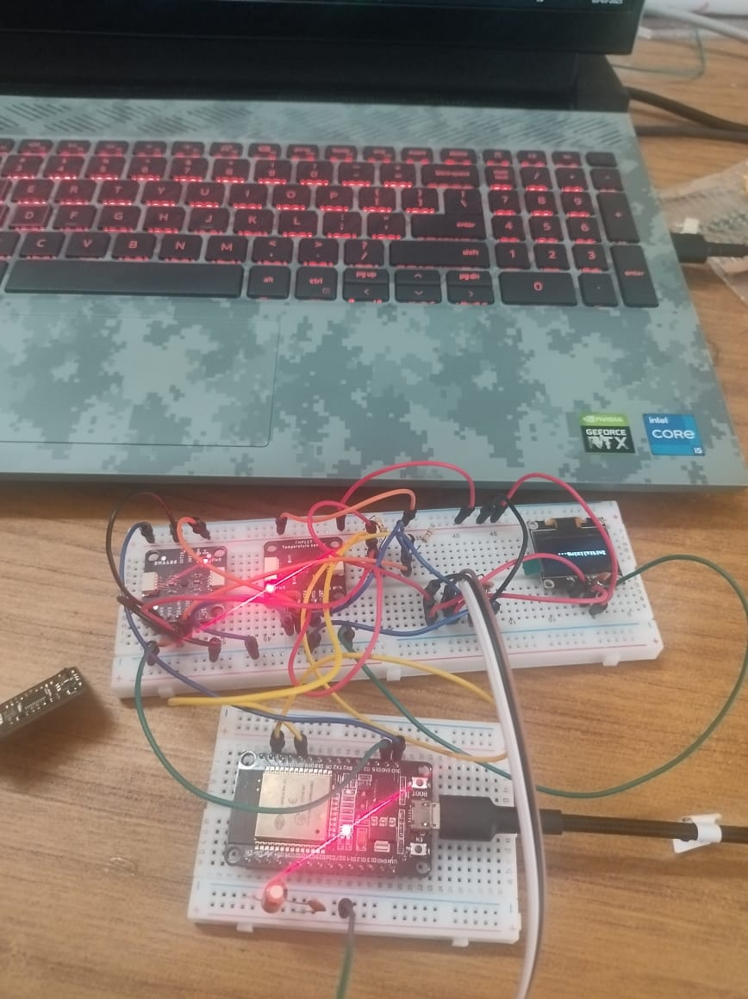
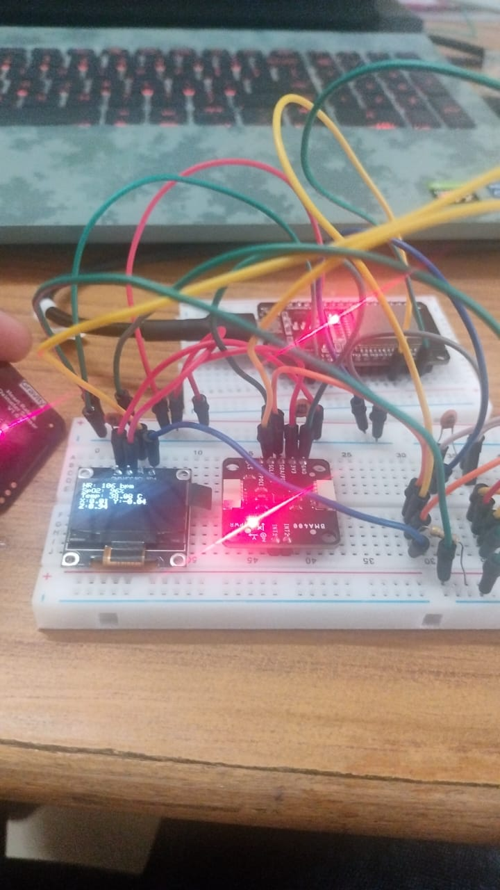
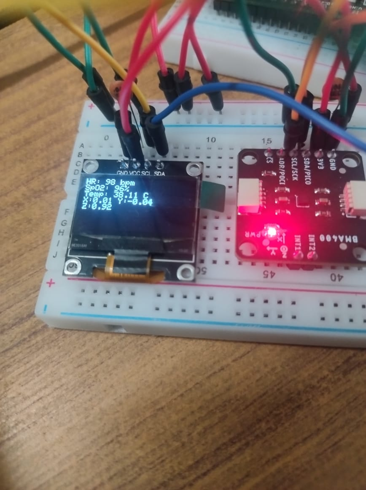
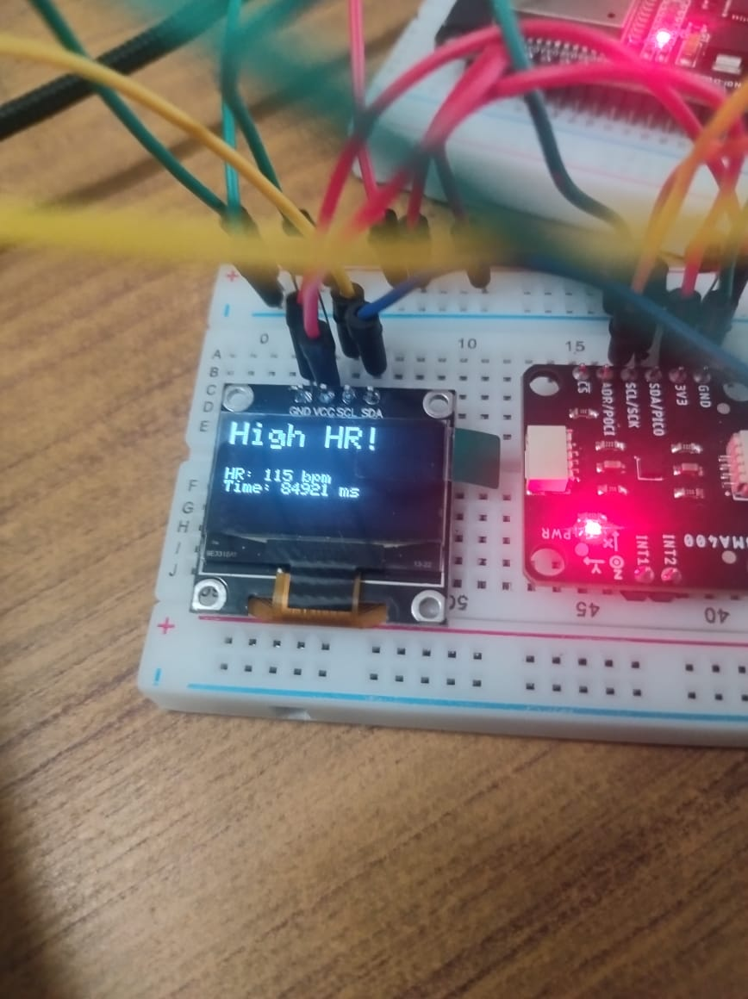
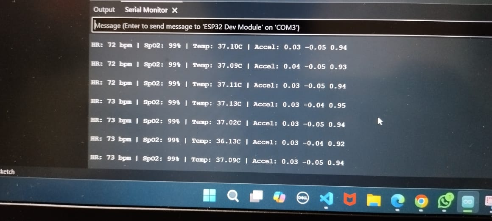
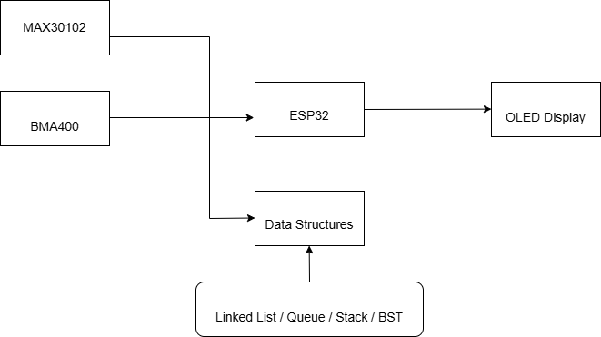
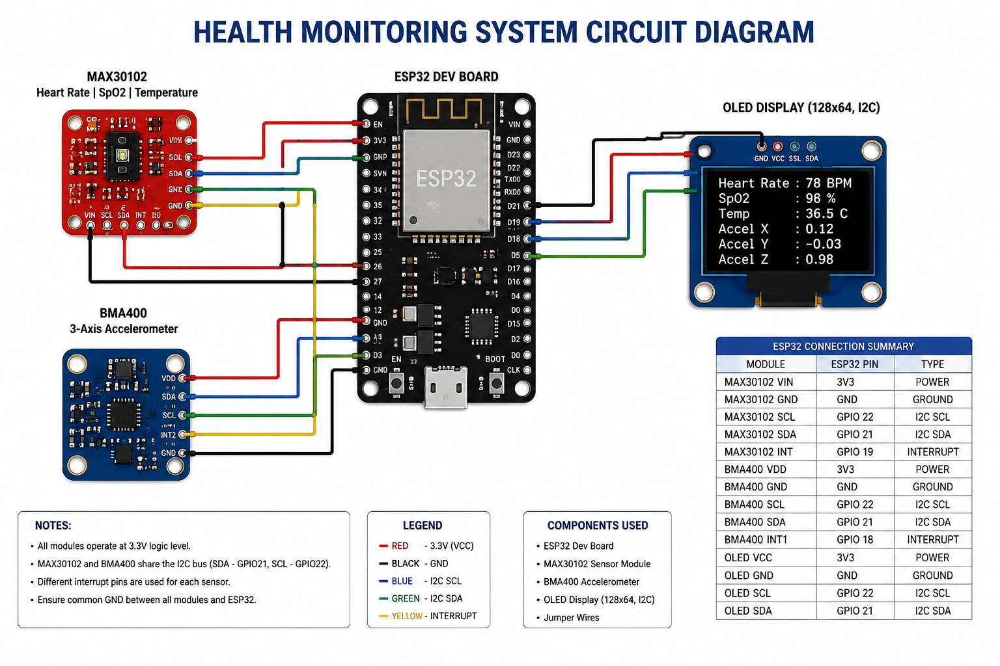
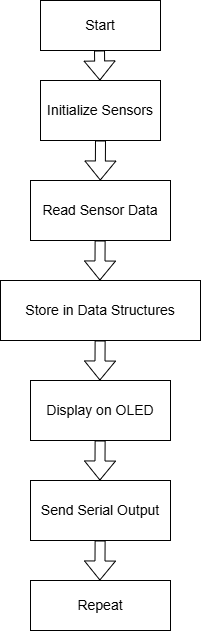

# Real-Time Health Monitoring System using ESP32

## Overview
This project presents a real-time healthcare monitoring system using ESP32, MAX30102, and BMA400 sensors. The system monitors heart rate, SpO2, temperature, and motion data while utilizing data structures such as Linked Lists, Queues, Stacks, and Binary Search Trees for efficient real-time data processing and monitoring.

## Features
- Real-Time Heart Rate Monitoring
- SpO2 Monitoring
- Temperature Monitoring
- Motion Detection using BMA400
- OLED Display Output
- Wi-Fi Based Monitoring
- Data Logging using Linked List
- Real-Time Queue Processing
- Alert Monitoring System
- I2C Communication Recovery

## Hardware Setup

- ESP32 Dev Board
- MAX30102 Sensor
- BMA400 Accelerometer
- OLED Display (128x64, I2C)
- Breadboard
- Jumper Wires
- USB Cable
- Power Supply

## OLED Output

## Serial Monitor Output

## System Architecture

## Data Structures Used
### Linked List
Used for storing complete sensor data history.

### Circular Queue
Used for real-time rolling sensor data processing.

### Alert Queue
Used for storing alert history.

### Average Heart Rate Processing
Used for monitoring abnormal heart rate conditions.

## Circuit Diagram

## Flowchart

## Pin Connections
| Component | ESP32 Pin |
|-----------|------------|
| SDA | GPIO21 |
| SCL | GPIO22 |
| OLED SDA | GPIO21 |
| OLED SCL | GPIO22 |

## Software Used
- Arduino IDE
- Embedded C/C++
- ESP32 Board Package
- Adafruit SSD1306 Library
- MAX30102 Sensor Library
- SparkFun BMA400 Library

## Results
- Successfully monitored Heart Rate and SpO2 values
- Real-time sensor data displayed on OLED
- Motion data collected using BMA400
- Sensor values streamed through Serial Monitor
- Web-based monitoring interface created using ESP32 Wi-Fi
- Data structures successfully implemented for real-time processing

## Demo Video

[Watch Demo Video](demo/health-monitoring-demo.mp4)

## Future Enhancements
- Cloud Data Storage
- Mobile Application Integration
- AI-based Health Prediction
- Emergency Alert System
- SD Card Data Logging
- Wearable Device Integration

## License
This project is licensed under the MIT License.